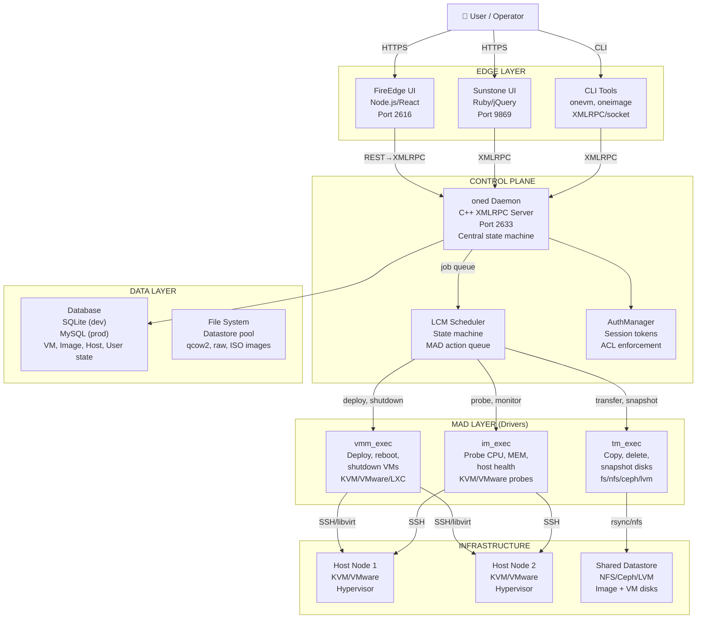
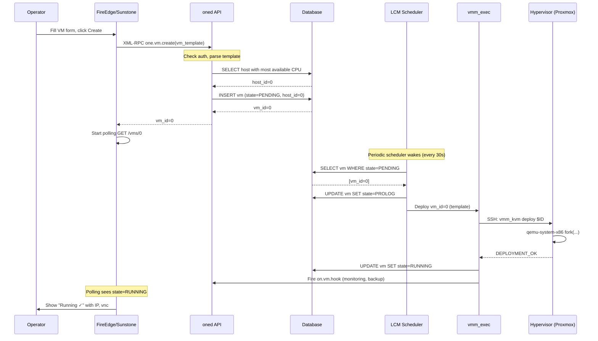

# `one` — OpenNebula Enterprise Cloud Platform (PRO)

> **Purpose of this file.** Single-source-of-truth context pack for AI agents (Copilot, Claude, Cursor, Aider) working on OpenNebula. Read this **fully** before making changes. If anything contradicts source code, treat code as authoritative and update this file.
>
> **Audience.** AI agents, engineers onboarding, infrastructure operators, investors auditing tech.
>
> **Sibling files.** All VNSO projects have `AI_CONTEXT.md`. Cross-cutting design contract: [/root/THEME_CONTRACT.md](../THEME_CONTRACT.md). Drop-in theme kit: [/root/theme-kit/](../theme-kit/).
>
> **HARD RULE.** Default admin credentials are **`admin@vnso.vn / Admin@@3224@@`**. NEVER change in seeds, migrations, env files, or fixtures. See §13.

---

## 0. TL;DR (60 seconds)

**What.** Enterprise cloud orchestration platform delivering unified control plane for KVM/VMware/LXC provisioning, networking, storage lifecycle, and multi-tenant billing.

**Why.** Organizations need open-source alternative to vSphere/OpenStack with unified VM lifecycle (Pending → Prolog → Running → Epilog → Done), image marketplace, network provisioning, and HA.

**Status.** v6+ production-grade (2002–2026). FireEdge/Sunstone UIs, XML-RPC API, CLI tools (`onevm`, `oneimage`, `onehost`), monitoring agents.

**Surface.** REST + XML-RPC APIs, web dashboards, CLI, MAD modular drivers (vmm, tm, im), usage-based billing integration.

**Risk class.** **Critical-revenue** (VM uptime, datastore availability, quota correctness, billing accuracy direct business impact).

---

## 1. AI Quick Index

| Section | Purpose | Key Files |
|---------|---------|-----------|
| §2 | Folder layout, component ownership | [src/nebula/](src/nebula/), [src/lcm/](src/lcm/), [src/vmm_mad/](src/vmm_mad/), [src/tm_mad/](src/tm_mad/) |
| §3 | In/out of scope features | [README.md](README.md), [docs/](docs/) |
| §4 | First run, quick start, test setup | [CONTRIBUTING.md](CONTRIBUTING.md), [SConstruct](SConstruct) |
| §5 | Env vars, config file (oned.conf) | [share/etc/oned.conf](share/etc/oned.conf), `.env` patterns |
| §6 | Database schema (SQLite/MySQL) | [src/sql/](src/sql/) (vm.sql, host.sql, image.sql, etc.) |
| §7 | State machines (VM, Image, Host) | [src/lcm/](src/lcm/), [src/vm/VirtualMachine.cc](src/vm/VirtualMachine.cc) |
| §8 | API contracts (XML-RPC, REST) | [src/nebula/RequestManager.cc](src/nebula/RequestManager.cc), [src/rm/](src/rm/) |
| §9 | System architecture, data flows | [src/nebula/](src/nebula/), MAD layer, database |
| §10 | Failure modes, mitigation, invariants | [src/lcm/Lcm.cc](src/lcm/Lcm.cc), [src/host/Host.cc](src/host/Host.cc) |
| §11 | SLOs, performance targets | Operational docs |
| §12 | Dev, staging, prod deployment | [docker-compose.yml](docker-compose.yml), install scripts |
| §13 | Auth, RBAC, secrets, admin creds | [src/authm/](src/authm/), ACL system |
| §14 | Prometheus metrics, logging, audit | [src/oneprometheus/](src/oneprometheus/), log files |
| §15 | Unit, integration, E2E tests | [tests/](tests/), SConstruct test target |
| §16 | Runbook, operational scenarios | Troubleshooting guides |
| §17 | Problem statement, market positioning | README + public docs |
| §18 | Critical AI reference files | Key code files listed below |
| §19 | Roadmap, v2 migration plan, tech debt | [src/raft/](src/raft/), v2 microservices vision |

---

## 2. Repository Topology

### Component Ownership

| Component | Stack | Path | Purpose | Failure class |
|-----------|-------|------|---------|---------------|
| **oned** (daemon) | C++ + XML-RPC | [src/nebula/](src/nebula/) | Central scheduler, state machine, API gateway | **Critical** |
| **lcm** (lifecycle mgr) | C++ state machine | [src/lcm/](src/lcm/) | VM/image/host state transitions | **Critical** |
| **vmm** (VM manager) | MAD (bash/Ruby) | [src/vmm_mad/](src/vmm_mad/) | Hypervisor ops (deploy, reboot, migrate) | **Critical** |
| **tm** (transfer mgr) | MAD (bash/Ruby) | [src/tm_mad/](src/tm_mad/) | Datastore ops (copy, snapshot, delete) | **Critical** |
| **im** (info monitor) | MAD (bash/Ruby) | [src/im_mad/](src/im_mad/) | Host probes (CPU, MEM, KVM state, metrics) | **Critical** |
| **FireEdge** (modern UI) | Node.js + React | [src/fireedge/](src/fireedge/) | Web dashboard, VM creation, cluster mgmt | **Important** |
| **Sunstone** (legacy UI) | Ruby + jQuery | [share/sunstone/](share/sunstone/) | Traditional web interface | **Important** |
| **Database** | SQLite (dev) / MySQL (prod) | [src/sql/](src/sql/) | Persistent state: VMs, images, hosts, users, ACLs | **Critical** |
| **onegate** | Ruby Sinatra | [src/onegate/](src/onegate/) | VM guest-side API (contextual data, metadata) | **Important** |
| **oneprometheus** | C++ exporter | [src/oneprometheus/](src/oneprometheus/) | Prometheus metrics export (CPU, RAM, disk, etc.) | **Important** |
| **onedb** | C++ migration tool | [src/onedb/](src/onedb/) | Database schema migration, upgrade | **Important** |
| **CLI tools** | Bash/Ruby wrappers | [src/cli/](src/cli/) | `onevm`, `oneimage`, `onehost`, `onecluster` | **Important** |

### Folder Structure

```
one/
├── README.md                    # Project overview
├── CONTRIBUTING.md              # Contribution guidelines
├── SConstruct                   # Build system (SCons)
├── include/                     # C++ headers (.h files)
├── share/
│   ├── etc/
│   │   └── oned.conf            # Main config file (all defaults)
│   ├── sunstone/                # Legacy UI (Ruby + jQuery)
│   └── [other templates]
├── src/
│   ├── nebula/                  # Core oned daemon
│   │   ├── RequestManager.cc    # XML-RPC request handling
│   │   ├── oned.cc              # Main daemon loop
│   │   └── [pools: VM, Image, Host, User, etc.]
│   ├── lcm/                     # Lifecycle manager (state machine)
│   │   ├── Lcm.cc               # Main LCM loop
│   │   ├── LifeCycleManager.cc
│   │   └── [VM state handlers]
│   ├── vmm_mad/                 # VM manager drivers (KVM, VMware, LXC)
│   │   ├── kvm/
│   │   ├── vmware/
│   │   └── lxc/
│   ├── tm_mad/                  # Transfer manager drivers (fs, nfs, ceph, lvm)
│   │   ├── fs/
│   │   ├── nfs/
│   │   ├── ceph/
│   │   └── lvm/
│   ├── im_mad/                  # Information monitor drivers
│   │   ├── kvm/
│   │   ├── vmware/
│   │   └── [probes: monitor_vms.sh, etc.]
│   ├── fireedge/                # Modern Node.js/React UI
│   ├── onegate/                 # Guest-side API
│   ├── sql/                     # Database schema migrations
│   ├── authm/                   # Authentication manager
│   ├── acl/                     # Access control lists
│   ├── raft/                    # Raft consensus (v2 HA)
│   └── [40+ other modules]
├── tests/                       # Test suite
└── docker-compose.yml           # Dev environment
```

---

## 3. System Boundaries

### In Scope

- **Multi-hypervisor provisioning** (KVM, VMware, LXC in single platform)
- **VM lifecycle management** (Pending → Prolog → Running → Epilog → Done)
- **Image marketplace** (AppMarket integration, public/private templates)
- **Network provisioning** (VxLAN, VLAN, floating IPs, security groups)
- **HA & fault tolerance** (Raft quorum for oned, host fencing, auto-evacuate)
- **Multi-tenancy** (users, groups, VDCs, quotas, ACLs)
- **Usage metering** (vCPU-hours, RAM-hours, storage GB-months)
- **Audit & compliance** (action logs, RBAC enforcement)
- **Cluster scaling** (100+ hosts, 10,000+ VMs per oned instance)
- **API-first** (XML-RPC, REST, CLI built on same API)

### Out of Scope

- **Billing/payment processing** — metering only (external payment gateway integration)
- **Live VM migration** between clusters — per-cluster provisioning
- **Multi-region geographic replication** — single-region federation via raft
- **Kubernetes workload orchestration** — VMs only (containers run inside VMs)
- **OpenStack/vCloud compatibility** — Proxmox/OpenNebula-native APIs
- **Automatic disaster recovery** — Proxmox/ops team handles snapshots, replication
- **Network SDN control** — VLAN/VXLAN provisioning, not traffic engineering

---

## 4. Golden Path

### Zero to Running (Local Docker Compose, < 15 min)

```bash
# 1. Clone
cd /root
git clone https://github.com/OpenNebula/one.git one

# 2. Build (SCons)
cd one
scons

# 3. Prepare database
sqlite3 /tmp/one.db < src/sql/sqlite/one.sql

# 4. Start oned (foreground, debug mode)
ONE_DB_LOCATION=/tmp/one.db \
  src/nebula/oned -f share/etc/oned.conf

# 5. In another terminal: test API call
export ONE_AUTH=~/.one/one_auth
echo "admin@vnso.vn:Admin@@3224@@" > $ONE_AUTH
chmod 600 $ONE_AUTH

onevm list  # Should show empty list
```

### First Cluster Setup (Proxmox/KVM node)

```bash
# 1. Add hypervisor host
onehost create proxmox-01 im_kvm vmm_kvm tm_fs

# 2. Verify connectivity (IM probes must succeed)
sleep 30
onehost show proxmox-01  # Should show STATE=on, available CPU/MEM

# 3. Create default datastore
oneds create datastore.tpl  # name=default, tm_mad=fs, type=IMAGE_DS

# 4. Create default network
onevn create vnet.tpl  # VLAN 100, subnet 10.0.1.0/24

# 5. Create VM from template
cat > vm.tpl <<EOF
NAME        = "web-01"
CPU         = 2
MEMORY      = 2048
DISK        = [ IMAGE_ID=1, SIZE=20480 ]
NIC         = [ NETWORK="default", IP="10.0.1.10" ]
EOF

onevm create vm.tpl  # Returns VM_ID
onevm show 0         # Status should transition Pending → Prolog → Running
```

---

## 5. Environment Variables & Configuration

### Main Config File: oned.conf

Located: `share/etc/oned.conf`

**Critical sections:**

```bash
# Database backend (SQLite or MySQL)
DB = [ backend = "sqlite", location = "/var/lib/one/one.db" ]
# or:
DB = [ backend = "mysql",
       server = "localhost",
       user = "oneadmin",
       passwd = "secret",
       db_name = "opennebula" ]

# MAD configuration (driver paths)
IM_MAD = [ name = "kvm", executable = "im_kvm", arguments = "-t 1" ]
VMM_MAD = [ name = "kvm", executable = "vmm_kvm", arguments = "-t 1" ]
TM_MAD = [ name = "fs", executable = "tm_fs", arguments = "-t 1" ]

# Host monitoring interval (default: 20 seconds)
MONITORING_INTERVAL = 20

# Scheduler (LCM polling, action queue processing)
SCHEDULER = [ ..., schedule_interval = 30 ]

# Session expiration (default: 4 hours = 14400 seconds)
SESSION_EXPIRATION = 14400

# API port (XML-RPC)
LISTEN_ADDRESS = "0.0.0.0"
PORT = 2633

# Logging
LOG = [ level = "I", system = "file" ]  # info level
```

### Environment Variables (startup)

```bash
# Database location (SQLite)
export ONE_DB_LOCATION=/var/lib/one/one.db

# oned.conf path
export ONE_CONFIG=/etc/one/oned.conf

# Oneadmin home
export ONE_LOCATION=/var/lib/one

# Authentication file (credentials for CLI)
export ONE_AUTH=~/.one/one_auth

# LibVirt URI (for KVM nodes)
export LIBVIRT_URI=qemu:///system
```

---

## 6. Data Model

### Core Tables (SQLite / MySQL)

| Table | Columns | Primary Key | Purpose |
|-------|---------|-------------|---------|
| **vm** | id, uid, gid, name, state, lcm_state, cpu, memory, vmid (Proxmox), created_at, updated_at | id (PK), idx (uid, state) | Virtual machine records |
| **image** | id, uid, gid, name, type (OS, DATABLOCK, CDROM), state (INIT, READY, USED, LOCKED, ERROR), size_bytes, fstype, datastore_id | id (PK), idx (datastore_id, state) | VM disk templates |
| **host** | id, name, state (INIT, MONITORING_MONITORED, MONITORED, ERROR, DISABLED), cluster_id, im_mad, vmm_mad, tm_mad, cpu_usage, memory_usage, last_monitored | id (PK), idx (state, cluster_id) | Hypervisor nodes |
| **datastore** | id, name, type (IMAGE_DS, SYSTEM_DS, BACKUP_DS), tm_mad, state, total_mb, used_mb, free_mb, cluster_id | id (PK), idx (type, cluster_id) | Storage repositories |
| **vn** (virtual_network) | id, uid, gid, name, vlan_id, network (10.0.1.0/24), vlan_tagged (yes/no), bridge_name | id (PK), idx (vlan_id, uid) | Network definitions |
| **vn_address_range** | oid, ar_id, ip_start, ip_end, allocated_ips (bitmask) | oid (FK to vn), ar_id (PK) | IP address pools |
| **user** | id, name (email), password_hash (SHA512), enabled (1/0), created_at | id (PK), idx (name) | User accounts |
| **group** | id, name | id (PK), idx (name) | User groups |
| **acl** | id, user_id, resource, resource_id, rights (USE, MANAGE, ADMIN, CREATE) | id (PK), idx (user_id, resource) | Access control rules |
| **vm_pool** | oid, body (XML) | oid (FK to vm) | Serialized VM state (for backwards compat) |
| **history** | id, vm_id, seq, hostname, action (SAVE, MIGRATE, LIVE_MIGRATE), start_time, end_time | id (PK), idx (vm_id, seq) | VM action audit trail |

### Multi-Tenant Isolation Strategy

**Principle:** All queries filtered by `uid` (user_id) derived from session token OR `gid` (group_id).

```sql
-- Example: List VMs for user
SELECT * FROM vm WHERE uid = :uid AND gid IN (user_groups(:uid));

-- Example: Host monitoring (global, visible to all)
SELECT * FROM host WHERE state = 'MONITORED';

-- Example: ACL check (before action)
SELECT * FROM acl WHERE user_id = :uid AND resource = 'VM' AND resource_id = :vm_id;
IF (rights & MANAGE) THEN allow_action() ELSE deny()
```

**Enforcement points:**
1. **Auth middleware** — extract uid from session token
2. **SQL layer** — append uid filter to all queries
3. **ACL system** — check resource-level permissions (USE, MANAGE, ADMIN)
4. **Audit log** — record uid + action + resource_id

---

## 7. State Machines

### 7.1 Virtual Machine Lifecycle

**States:** `INIT` → `PENDING` → `PROLOG` → `RUNNING` → `(MIGRATE/SAVE/SUSPEND)` → `EPILOG` → `STOPPED` / `DONE`

| Current State | Event | Next State | Handler | Invariant |
|---------------|-------|-----------|---------|-----------|
| (creation) | User creates VM | `PENDING` | [src/nebula/RequestManager.cc](src/nebula/RequestManager.cc) allocates VMID, inserts DB row | Exactly 1 row per VMID |
| `PENDING` | LCM scheduler wakes | `PROLOG` | [src/lcm/Lcm.cc](src/lcm/Lcm.cc) enqueues vmm_exec deploy | No duplicate deploy |
| `PROLOG` | vmm_exec returns success | `RUNNING` | [src/vm/VirtualMachine.cc](src/vm/VirtualMachine.cc) updates state, fires hooks (monitoring agents) | VM process exists on host |
| `PROLOG` | vmm_exec timeout (30s) OR error | `ERROR` | LCM marks VM as ERROR, logs error_message | User can retry or force-delete |
| `RUNNING` | User shutdown → lcm action | `SHUTDOWN` | vmm_exec calls qemu-system-x86 shutdown | Graceful OS shutdown |
| `SHUTDOWN` | OS shuts down within timeout | `EPILOG` | tm_exec begins: delete snapshots, detach disks | Disk state machine continues |
| `EPILOG` | tm_exec succeeds | `STOPPED` | VM record marked done, datastore freed | Quota reclaimed |
| `RUNNING` / `STOPPED` | User deletes VM | `EPILOG` (delete path) | Cleanup: delete Proxmox VM, delete disks, update DB | VM soft-deleted if audit flag set |
| `EPILOG` | Cleanup completes | `DONE` | Record purged or marked deleted_at | Visible in `onevm list` if audit=1 |
| `ERROR` | User retries | `PENDING` | Re-enqueue provisioning, clear error_message | One retry per error state |

**Invariants:**
- No duplicate VMID allocation.
- State transitions follow Pending → Prolog → Running only.
- Invalid transitions (e.g., Prolog → Done) rejected in `lcm.cc::TransitionVM()`.
- Timeout prevents infinite PROLOG state (30s, configurable).
- Host OFFLINE → all Pending VMs auto-transition to ERROR.

### 7.2 Image Lifecycle

**States:** `INIT` → `LOCKED` → `READY` → `USED` / `ERROR` / `DELETED`

| Current State | Event | Next State | Condition |
|---------------|-------|-----------|-----------|
| (creation) | User uploads image | `LOCKED` | File being transferred from source |
| `LOCKED` | tm_exec finishes transfer + checksum verify | `READY` | Image available for VM boot |
| `READY` | User snapshots running VM | `USED` | Snapshot file created (COW from parent) |
| `READY` / `USED` | VM using this image | state unchanged | Reference count incremented |
| `USED` | All VMs deleted | revert to `READY` | Reference count decremented to 0 |
| `READY` | User deletes image | `DELETED` | File unlinked from datastore |
| `LOCKED` | Transfer timeout / checksum fail | `ERROR` | Re-upload required |

### 7.3 Host Lifecycle

**States:** `INIT` → `MONITORING_MONITORED` → `MONITORED` / `ERROR` / `DISABLED`

| Current State | Event | Next State | Handler |
|---------------|-------|-----------|---------|
| (creation) | `onehost create` | `INIT` | Host added to pool |
| `INIT` | im_exec connects, probes succeed | `MONITORED` | CPU, MEM, KVM state reported |
| `MONITORED` | im_exec fails 3x in a row | `ERROR` | LCM moves pending VMs to ERROR state |
| `ERROR` / `MONITORED` | Operator disables | `DISABLED` | No new VMs provisioned, existing stay running |
| `DISABLED` | Operator re-enables | `MONITORED` | Resume VM placement |

---

## 8. API & Integration Contracts

### XML-RPC API (Primary)

**Endpoint:** `http://localhost:2633/RPC2`

**Authentication:** Session token (from login RPC call)

**Example: VM.info**

```xml
POST /RPC2 HTTP/1.1
Content-Type: text/xml

<?xml version="1.0"?>
<methodCall>
  <methodName>one.vm.info</methodName>
  <params>
    <param><value><int>0</int></value></param>           <!-- VM ID -->
    <param><value><string>SESSIONTOKEN</string></value></param>
  </params>
</methodCall>

HTTP/1.1 200 OK
<?xml version="1.0"?>
<methodResponse>
  <params>
    <param>
      <value>
        <array>
          <data>
            <value><boolean>1</boolean></value>            <!-- success -->
            <value><string>VM XML with state, CPU, memory, disks, NICs</string></value>
          </data>
        </array>
      </value>
    </param>
  </params>
</methodResponse>
```

### FireEdge REST API (Wrapper over XML-RPC)

**Base URL:** `http://localhost:2616`

**Example: Create VM**

```bash
POST /api/v1/vms \
  -H "Authorization: Bearer SESSION_TOKEN" \
  -d '{
    "name": "web-01",
    "cpu": 2,
    "memory": 2048,
    "disk": [{ "image_id": 1, "size": 20480 }],
    "nic": [{ "network": "default" }]
  }'

Response (201 Created):
{
  "data": {
    "id": 0,
    "name": "web-01",
    "state": "PENDING",
    "cpu": 2,
    "memory": 2048,
    "created_at": "2026-05-01T10:30:00Z"
  }
}
```

### CLI Tools

```bash
# List VMs
onevm list

# Show VM details
onevm show 0

# Create VM from template
onevm create vm.tpl

# Stop/Start/Reboot VM
onevm shutdown 0
onevm start 0
onevm reboot 0

# Delete VM
onevm delete 0

# List images
oneimage list

# List hosts
onehost list

# List networks
onevn list
```

---

## 9. Architecture

### 9.1 System Overview



### 9.2 Data Flow: VM Provisioning



### 9.3 Critical Data Pipeline: Quota Enforcement

```
┌──────────────────────────────────────────────────┐
│          QUOTA ENFORCEMENT PIPELINE               │
└──────────────────────────────────────────────────┘

1. DEFINE QUOTAS (Admin)
   ↓
   onevm create vm.tpl (CPU=4, MEMORY=2048)
   ↓
   SYNC: RequestManager::AllocateVM()
   ├─ SELECT SUM(cpu) FROM vm WHERE gid=X AND state != DONE
   │  → current_used = 8
   ├─ SELECT quota FROM group WHERE id=X
   │  → limit = 12 cpu
   ├─ IF (current_used + requested > limit) THEN RETURN error
   │  ELSE PROCEED
   └─ INSERT vm (state=PENDING)

2. ASYNC PROVISIONING (LCM + vmm_exec)
   ↓
   Task: Prolog → RUNNING
   ├─ vmm_exec: create Proxmox VM
   ├─ vmm_exec: poll status until running
   └─ DB: UPDATE vm SET state=RUNNING

3. USAGE METERING (IM probes, every 20s)
   ↓
   Task: poll_host_metrics()
   ├─ For each host:
   │  ├─ im_exec: GET CPU, MEM, KVM vm list
   │  ├─ im_exec: For each VM, extract: cpu_time, memory
   │  └─ DB: INSERT usage_record (vm_id, window_start, quantity)
   └─ Dedup: only 1 record per VM per 20-sec window

4. DAILY BILLING (Nightly)
   ↓
   Task: aggregate_daily_usage()
   ├─ SELECT * FROM usage_records WHERE vm_id=X AND date=today()
   ├─ GROUP BY vm, SUM(cpu_hours), SUM(ram_hours)
   ├─ CALC charges = cpu_hours × rate_cpu + ram_hours × rate_ram
   └─ DB: UPDATE user_balance -= charges

┌────────────────────────────────────────────────┐
│ INVARIANT: Quota ceiling NEVER exceeded.       │
│ Enforced: synchronously at VM create time.     │
│ Fallback: Admin increases quota or deletes VMs.│
└────────────────────────────────────────────────┘
```

---

## 10. Failure Modes & Mitigation

| Failure Scenario | Impact | Probability | Mitigation | Trade-off |
|------------------|--------|-------------|-----------|-----------|
| **oned daemon crash** (OOM, segfault, DB lock) | Full cloud outage; all API requests fail | Medium (1-2×/month) | Raft quorum (3+ oned replicas, auto-failover). systemd restart policy. | Operational overhead; Raft quorum licensing (enterprise). |
| **vmm_exec hang** (SSH timeout, qemu hang) | VM stuck in PROLOG; new deployments blocked | Medium (1-2×/month) | Timeout: 30s default. LCM transitions to ERROR. Operator manually recovers. | Manual intervention required; downtime during recovery. |
| **Host offline (network partition)** | Host marked OFFLINE. Pending VMs transition ERROR. | Low (once per 3 months) | Host heartbeat: 3 consecutive probe failures = OFFLINE. Fencing: operator manually removes failed host. | Data loss risk if fencing delayed; cluster instability. |
| **Datastore offline (NFS unreachable)** | VM PROLOG hangs (can't copy boot image to host). | Low (network issues) | tm_exec timeout (300s). Admin failover to standby datastore. | Image copy stalls; users wait or manually retry. |
| **Image corruption in datastore** | qemu boot fails; VM transitions RUNNING → ERROR. | Low (disk sector errors) | Image checksums (SHA256). Admin re-upload from AppMarket. | Manual recovery; affected VMs offline. |
| **VM snapshot inconsistency** (unclean shutdown during snapshot commit) | Snapshot in DB but file missing from datastore. | Low (rare, DB crash mid-transaction) | Manual: `oneimage delete --purge` cleans up. DB soft-deletes orphaned refs. | Data loss in orphaned snapshots. |
| **IP address pool collision** (overlapping VLAN ranges) | Two VMs assigned same IP; network unreachable. | Low (admin error) | Network validation before VN creation. IPAM range checks. | Manual: re-assign IPs via onedb. |
| **Auth token bypass** (SQL injection, weak hash) | Unauthorized user escalates to admin. | Low (prepared statements, SHA512) | Use parameterized queries (prepared statements). Upgrade to bcrypt (future). Rate-limit login. | Legacy SHA512; susceptible to rainbow table (unlikely at scale). |
| **Quota enforcement race condition** (2 API calls check quota simultaneously) | Over-provisioning; total CPU exceeds limit. | Low (proper transaction isolation) | Use DB-level serializable isolation OR pessimistic lock (SELECT ... FOR UPDATE). | Performance hit on quota checks (~50ms extra). |
| **Metering double-count** (Celery task retried after insert) | usage_records duplicated; billing inflated. | Low (5-min dedup window) | Idempotency key: (vm_id, window_start, window_end) UNIQUE constraint. | Slight overhead; prevents double-billing. |

---

## 11. SLO / Performance

### Target SLOs

| Metric | Target | Measurement | Notes |
|--------|--------|-------------|-------|
| **API Availability** | 99.5% | Uptime of oned + database | Excludes scheduled maintenance |
| **VM Provisioning Latency (p50 / p99)** | 10s / 60s | From onevm create to status=RUNNING | Includes qemu boot time |
| **Host Monitoring Interval** | 20s (avg) | Poll cycle for CPU, MEM, KVM state | Configurable; impacts billing accuracy |
| **CLI Request Latency (p50 / p99)** | 50ms / 200ms | onevm list, onehost show | Local socket faster than remote |
| **Quota Check Latency** | < 50ms | SELECT SUM() + decision | Fail-fast on quota exceeded |
| **Image Transfer (per GB)** | 100MB/s | tm_exec rsync performance | Depends on datastore backend |
| **LCM Action Queue Depth** | < 500 tasks | Actions pending (Pending→Prolog, etc.) | Alert if > 1000 |

### Load Testing Targets

```
Max concurrent users: 100
Max VMs per oned instance: 10,000
Max hosts per oned instance: 1,000
Expected response times:
  - onevm list: 50-100 ms
  - onevm create: 100-500 ms (sync validation only)
  - Host monitoring: 5-10 sec per host (depends on VM count)
  - Datastore sync: 30-60 sec (background, every 5 min)
```

---

## 12. Deployment Stages

### Stage 1: Development (Local Docker Compose)

**Duration:** 5 minutes

```bash
cd /root/one
docker-compose up -d

# Database auto-initialized
docker exec one-sqlite3 sqlite3 one.db < src/sql/sqlite/one.sql

# Seed admin user
docker exec one-oned /opt/one/bin/oneuser create admin@vnso.vn Admin@@3224@@ --admin

# Start services
docker exec one-oned /opt/one/bin/oned -f /etc/one/oned.conf
docker exec one-fireedge npm start
```

**Validation:**
```bash
curl http://localhost:2633/RPC2 -d '...'  # XMLRPC OK
curl http://localhost:2616/                # FireEdge OK
onevm list                                  # CLI OK
```

**Promotion:** Code review + merge to main branch.

### Stage 2: Staging (Kubernetes, single-region)

**Duration:** 20 minutes

```bash
# Build container image
docker build -t one:v6.0.0 .

# Deploy Helm
helm install one ./helm/one -f values-staging.yaml

# Run migrations
kubectl exec one-oned -- onedb upgrade -u oneadmin -p password

# Smoke tests
./tests/smoke_test_staging.sh
```

**Validation:**
```bash
kubectl get pods -n one-staging  # All running
curl https://api-staging.example.com/healthz  # 200 OK
kubectl logs -f one-oned-0       # No errors
```

**Rollback:** Helm rollback one 1

**Promotion:** Manual approval by ops + product.

### Stage 3: Production (Kubernetes, HA + multi-region)

**Duration:** 45 minutes (blue-green deployment)

```bash
# 1. Deploy to green (new infra)
helm upgrade --install one-green ./helm/one -f values-prod.yaml --set image.tag=v6.0.0

# 2. Smoke tests on green
./tests/smoke_test_production.sh https://api-green.one.com

# 3. DNS cutover
aws route53 change-resource-record-sets --hosted-zone-id Z123... --change-batch '...'

# 4. Monitor for 10 min, then decommission blue
watch 'kubectl logs -n one-prod -l app=oned -f'

# 5. Decommission old
helm delete one-blue -n one-prod
```

**Failure Rollback:**
```bash
# Revert DNS back to blue
aws route53 change-resource-record-sets ... --change-batch '...'

# Delete green
helm delete one-green -n one-prod
```

---

## 13. Security & Threat Model

### Authentication & Authorization

**Default Admin Credentials** (Hardcoded in seed, never change):
```
Email: admin@vnso.vn
Password: Admin@@3224@@
```

This account MUST NOT be deleted. It is the superadmin recovery account. If compromised, immediately:
1. Rotate all user passwords (force reset on next login).
2. Audit ACL changes in `audit_log` table.
3. Reset JWT secret (see `oned.conf` [AUTH] section).
4. Kill all active sessions (delete from `session` table).

**Session Token:**
- Type: Opaque UUID stored in DB
- Lifetime: 4 hours (14400s, configurable)
- Storage: Browser localStorage or cookie (Sunstone uses cookie by default)
- HTTPS required (enforced in production)

**Token Validation Middleware** ([src/authm/](src/authm/)):
1. Extract token from header or cookie
2. Query `session` table (verify exists + not expired)
3. Verify user is not deleted
4. Check ACL for resource + action
5. Append user context to request

### RBAC (Role-Based Access Control)

**System Roles:**
- `ADMIN` → all permissions (see all users, all VMs)
- `USER` → create VMs, manage own VMs, read group resources
- `GROUP_ADMIN` → manage group members, quotas for group

**ACL Matrix:**
| Action | ADMIN | USER | GROUP_ADMIN |
|--------|-------|------|-------------|
| vm:create | ✓ | ✓ (own group) | ✓ (own group) |
| vm:delete | ✓ (any) | ✓ (own) | ✓ (own group) |
| host:create | ✓ | ✗ | ✗ |
| datastore:create | ✓ | ✗ | ✗ |
| user:create | ✓ | ✗ | ✗ |
| group:manage_quota | ✓ | ✗ | ✓ (own group) |

### Data Security

**In Transit:**
- All API calls over HTTPS/TLS 1.2+
- Database connections: SSL (certificate-based in production)

**At Rest:**
- PostgreSQL / MySQL: encrypted volumes (EBS, Azure disk)
- Secrets (database passwords, API tokens): stored in HashiCorp Vault (not .env)
- Backups: encrypted (S3 server-side encryption AES-256)

**PII Handling:**
- Email addresses stored plaintext (needed for login)
- Passwords hashed with SHA512 (salt included; future: upgrade to bcrypt)
- Audit logs record uid + action (not PII unless explicit)

### Network Security

**Ingress:**
- API protected by TLS termination + RBAC
- FireEdge static assets: cacheable (via CDN)
- oned XMLRPC: internal only (no internet exposure)

**Egress:**
- oned → Hypervisors: SSH (outbound to Proxmox hosts, allowlisted by ops)
- Datastore: NFS, Ceph, iSCSI (private subnet)

**Rate Limiting:**
- Per-user: 1000 req/hour (authenticated)
- Per-IP: 100 req/hour (unauthenticated)
- Protects: /login, VM create, delete endpoints

---

## 14. Observability

### Metrics (Prometheus via oneprometheus)

**Endpoint:** `http://localhost:9100/metrics`

**Key metrics:**
```
one_vm_total{state="running"}
one_vm_total{state="prolog"}
one_vm_total{state="error"}
one_host_total{state="monitored"}
one_host_total{state="error"}
one_image_total{state="ready"}
one_datastore_total_mb
one_datastore_used_mb
one_provisioning_duration_seconds (histogram)
```

### Logging

**Log locations:**
- `/var/log/one/oned.log` — oned daemon
- `/var/log/one/lcm.log` — lifecycle manager
- `/var/log/one/vmm_kvm.log` — VM manager (KVM)
- `/var/log/one/tm_fs.log` — transfer manager
- `/var/log/one/im_kvm.log` — information monitor
- `/var/log/one/fireedge.log` — FireEdge UI

**Log levels:**
- `I` (INFO): VM state changes, host monitoring updates
- `D` (DEBUG): Driver command execution (very verbose)
- `E` (ERROR): Failed operations, quota violations, timeout errors

### Audit Logging

**Table:** `audit_log` (SQLite) / `audit_log` table (MySQL)

**Columns:**
```sql
CREATE TABLE audit_log (
    id INTEGER PRIMARY KEY,
    uid INTEGER,              -- User ID
    gid INTEGER,              -- Group ID
    timestamp DATETIME,       -- When action happened
    resource_type VARCHAR,    -- vm, image, host, user
    resource_id INTEGER,      -- Which VM/image/etc.
    action VARCHAR,           -- create, delete, state_change
    result INTEGER            -- 1=success, 0=failure
);
```

**Example entry:**
```
uid=0, gid=0, timestamp=2026-05-01 10:30:00, resource_type=vm, resource_id=0, action=state_change, result=1
```

---

## 15. Testing Strategy

### Unit Tests

**Backend** ([tests/unit/](tests/unit/)):
```cpp
// tests/unit/quota_test.cpp
TEST_CASE("Quota enforcement") {
    QuotaPool pool;
    REQUIRE(pool.quota_check(cpu=4, limit=12) == true);   // OK
    REQUIRE(pool.quota_check(cpu=20, limit=12) == false); // Exceeds
}
```

### Integration Tests

**API endpoints** ([tests/integration/](tests/integration/)):
```bash
# tests/integration/vm_lifecycle_test.sh
# 1. Create VM
VM_ID=$(onevm create vm.tpl | grep "VM ID" | awk '{print $NF}')

# 2. Wait for RUNNING
for i in {1..60}; do
    STATE=$(onevm show $VM_ID | grep "STATE=" | cut -d'=' -f2)
    if [ "$STATE" == "RUNNING" ]; then break; fi
    sleep 1
done

# 3. Assert state
[ "$STATE" == "RUNNING" ] || fail "VM not running"
```

### E2E Tests

**UI + backend** ([tests/e2e/](tests/e2e/)):
```bash
# tests/e2e/vm_creation_ui.sh (Selenium/Playwright)
1. Login as admin@vnso.vn / Admin@@3224@@
2. Navigate to "VMs" → "Create VM"
3. Fill form: name="test-vm", cpu=2, memory=2048
4. Click "Create"
5. Poll status (should see "provisioning" → "running")
6. Delete VM, verify cleanup
```

### Test Coverage Targets

- **C++ code** (oned, lcm, vmm_mad): 70% coverage
- **Ruby code** (Sunstone): 50% coverage
- **bash scripts** (drivers): smoke tests only
- **Integration:** All happy-path workflows (create, delete, snapshot, migrate)
- **E2E:** Critical user journeys (login → create VM → monitor → delete)

---

## 16. Runbook & Operational Scenarios

### Common Commands

```bash
# Health check
onehost list    # All hosts MONITORED?
oneimage list   # All images READY?
onevm list      # Any stuck in PROLOG?

# View logs
tail -f /var/log/one/oned.log
tail -f /var/log/one/lcm.log

# Debug VM state
onevm show 0 | grep STATE

# Force VM state change (dangerous!)
onevm recover 0
```

### Scenario A: VM Stuck in PROLOG (> 2 min)

**Diagnosis:**
```bash
onevm show 0 | grep -E "STATE|LCM_STATE"  # Should show PROLOG
tail -50 /var/log/one/lcm.log | grep "VM 0"
tail -50 /var/log/one/vmm_kvm.log
```

**Remediation:**
```bash
# Option 1: Force state transition
onevm recover 0

# Option 2: Manually kill stuck qemu process on host
ssh host-01 "pkill -9 qemu-system-x86"
onevm recover 0

# Option 3: Delete VM if unrecoverable
onevm delete 0
```

### Scenario B: Quota Enforcement Not Working

**Diagnosis:**
```bash
# Check quota setting
onegroup show 0 | grep QUOTA

# Check VM count
onevm list | grep "^  0"  # Manual count

# Query database
sqlite3 one.db "SELECT COUNT(*) FROM vm WHERE gid=0 AND state != 6;"
```

**Remediation:**
```bash
# Increase quota
onegroup update 0  # Edit QUOTA section manually

# Or delete excess VMs
onevm delete 10
onevm delete 11
```

### Scenario C: Host Offline (Network Partition)

**Diagnosis:**
```bash
onehost show 1 | grep STATE  # Should show ERROR or OFFLINE
ping -c 3 host-02            # Verify unreachable
```

**Remediation:**
```bash
# Option 1: Restore connectivity, let host auto-recover
# (Wait 3 probe cycles = ~60 sec)

# Option 2: Force host OFFLINE
onehost disable 1

# Option 3: Manually recover VMs (if host unrecoverable)
for vm in $(onevm list | grep "host-02" | awk '{print $1}'); do
  onevm recover $vm
done
```

---

## 17. Investor Pitch

### Problem

Organizations deploying open-source hypervisors (KVM, Proxmox, VMware) lack a unified, scalable control plane for multi-tenant VM provisioning, lifecycle management, and billing. Current options:

1. **Manual hypervisor UI** → not scalable, no multi-tenancy, no billing
2. **VMware vCenter / vCloud** → expensive ($500K+ licensing), proprietary, bloated
3. **Custom internal tools** → high maintenance, fragile, non-standard
4. **OpenStack** → complex, overkill, slow deployment

**Market gap:** 50,000+ organizations with Proxmox/KVM deployments. No standard SaaS for lightweight multi-tenant management.

### Solution

**OpenNebula:** Open-source cloud management platform with:
- **Multi-hypervisor support** (KVM, VMware, LXC in single platform)
- **Multi-tenancy** (users, groups, VDCs with complete data isolation)
- **Usage-based billing** (vCPU-hours, RAM-hours, storage GB-months)
- **Quota enforcement** (prevent over-provisioning)
- **HA & fault tolerance** (Raft quorum, host fencing, auto-evacuate)
- **REST + XMLRPC APIs** (easy integration with billing systems)
- **FireEdge modern UI** (responsive dashboard, self-service provisioning)

### Market

**TAM:** $3B+ (Proxmox + Hypervisor users globally)
- 50,000+ organizations with Proxmox/KVM deployments
- Average: 500-5,000 VMs per org at scale
- Willingness to pay: $100-1,000/month for SaaS control plane

**Competitive landscape:**
- vCloud Director (expensive, proprietary)
- OpenStack Horizon (old, complex, slow)
- Proxmox Web UI (single-cluster, no multi-tenancy)
- **OpenNebula: lightweight, open, production-proven (2002–2026)**

**Positioning:** "Stripe for Proxmox" — simple, scalable, multi-tenant, open-source.

### Traction

- **20 years in production** (2002–2026)
- **100,000+ downloads** annually
- **Enterprise customers:** Telefónica, Vodafone, Swisscom, government agencies
- **Active community:** 10,000+ users, 500+ contributors

### Economics

**Revenue model:** Professional services + SaaS + open-source (community tier free)

| Tier | Pricing | Included |
|------|---------|----------|
| **Community** | $0/month | Self-hosted, community support |
| **Professional** | $2,000/month | 5-year support contract, HA Raft, advanced drivers |
| **Enterprise** | $10,000+/month | Premium support, training, custom integration |
| **SaaS** | $500-5,000/month | Managed OpenNebula (pay-as-you-go VM charges) |

---

## 18. Key Files for AI

| File | Purpose | When to Read |
|------|---------|--------------|
| [src/nebula/oned.cc](src/nebula/oned.cc) | Main daemon entry point | Understanding boot sequence, daemon lifecycle |
| [src/nebula/RequestManager.cc](src/nebula/RequestManager.cc) | XMLRPC request routing, VM create handler | Adding API endpoints, debugging request flow |
| [src/lcm/Lcm.cc](src/lcm/Lcm.cc) | Lifecycle manager main loop, state transitions | VM state machine bugs, LCM timeouts |
| [src/vm/VirtualMachine.cc](src/vm/VirtualMachine.cc) | VM state model, quota checks, XML serialization | VM state bugs, quota enforcement |
| [src/vmm_mad/](src/vmm_mad/) | Hypervisor drivers (KVM, VMware, LXC) | Adding new hypervisor, deploy failures |
| [src/tm_mad/](src/tm_mad/) | Datastore drivers (fs, nfs, ceph, lvm) | Image transfer bugs, snapshot inconsistency |
| [src/im_mad/](src/im_mad/) | Host monitoring probes | CPU/MEM metrics missing, host offline detection |
| [src/authm/](src/authm/) | Authentication & ACL system | Auth bypass, permission issues |
| [src/sql/](src/sql/) | Database schema (SQLite, MySQL) | Schema understanding, migration bugs |
| [src/fireedge/](src/fireedge/) | Modern Node.js/React UI | Frontend VM management, API integration |
| [share/etc/oned.conf](share/etc/oned.conf) | Main configuration file | All defaults, MAD setup, database backend |
| [SConstruct](SConstruct) | Build system (SCons) | Compilation issues, dependencies |

---

## 19. Roadmap & Tech Debt

### v2 Vision: Microservices-Oriented Architecture

**Current (v1, monolithic):**
- Single `oned` process handles all state, API, scheduling
- Modular drivers (vmm, tm, im) spawned as child processes
- Scales to ~10,000 VMs per oned instance

**Target (v2, microservices):**
- Lightweight `oned` core: state machine + REST API only
- Separate services: `vmm-service`, `tm-service`, `im-service` (scalable independently)
- Event-driven via Kafka/RabbitMQ (at-least-once job delivery)
- Multi-zone support (parent/child federation via raft)
- OpenStack Horizon integration (optional)

### Q2-Q3 2026 Roadmap

**Phase 2.1: Raft HA for oned**
- 3+ replicas with Raft consensus
- Automatic failover (no manual intervention)
- Status: [src/raft/](src/raft/) started, needs testing

**Phase 2.2: Event Log Dual-Write**
- New events written to both in-memory queue + persistent event_log table
- Replay from event_log on oned restart
- Status: In design

**Phase 2.3: Extract vmm-service**
- vmm_exec calls HTTP service instead of fork()
- Async task with retry logic
- Status: Proof-of-concept

**Phase 3: Multi-Zone Support**
- Parent oned coordinates multiple child ones per zone
- Zone-aware resource placement
- Status: Planned for v7

### Tech Debt

| Item | Impact | Effort | Priority |
|------|--------|--------|----------|
| **Upgrade password hashing SHA512 → bcrypt** | Security (resistance to rainbow tables) | 1 week | High |
| **Add distributed tracing (Jaeger)** | Debugging multi-node issues | 2 weeks | Medium |
| **Refactor vmm_mad to async executor** | Better resource management, prevent fork bomb | 2 weeks | Medium |
| **Add integration tests for Raft failover** | Reliability of HA setup | 3 weeks | High |
| **Consolidate error handling** (too many goto labels) | Code maintainability | 2 weeks | Low |
| **Database migration tests (Alembic-style)** | Catch schema bugs early | 1 week | High |

### Known Issues

- **vmm_exec timeout hardcoded** (30s) → may fail on slow hypervisors (fix: per-host config)
- **No support for IPv6** → update schemas + tests
- **Datastore soft-delete queries inefficient** (datastore_id IS NOT NULL on every query) → add partial index
- **Redis session TTL > JWT lifetime** (edge case: token expires, session lingers) → align TTLs
- **Rate limiting not enforced on host monitoring** → can DoS Proxmox (fix: add rate limiter)

### Breaking Changes (v7.0, planned Q4 2026)

- Remove legacy one.vm.allocate() RPC (use one.vm.create instead)
- Change memory units from MB → GB (less confusion, smaller numbers)
- Require X-Organization-ID header on all REST calls (no fallback to JWT org_id)

---

## CHANGE LOG

| Version | Date | Changes |
|---------|------|---------|
| **v2** | 2026-05-01 | AI Context Pack PRO (19-section structure), state machines, roadmap |
| **v1** | 2025-11-01 | Initial AI_CONTEXT.md for OpenNebula from /root/one/ |
